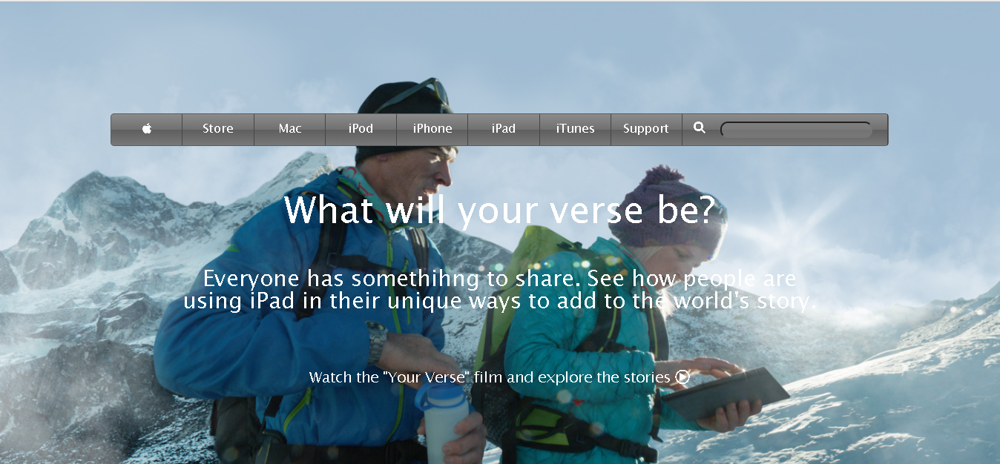

# Building with backgrounds and gradients

> This is a collaborative 4th project in the HTML5&CSS3 Microverse curriculum.

This project consists of building a webpage using images as a background and adding gradients to elements. The goal is to make a clone of old an old version of the Apple website webpage.

## Built With

- HTML 5
- CSS 3

## Live Demo

[Live Demo Link](https://raw.githack.com/vichuge/4-Building-with-Backgrounds-and-Gradients/feature-1/index.html)

## Getting Started

- Clone or download this project on your computer
- Open it with your favorite browser

## Authors

👤 **Victor Pacheco**

- GitHub: [@vichuge](https://github.com/vichuge)
- LinkedIn: [LinkedIn](https://www.linkedin.com/in/victor-pacheco-7946aab2/)

👤 **Mar Bautista**

- GitHub: [@marilirulita](https://github.com/marilirulita)
- Twitter: [@marylirulita](https://twitter.com/marylirulita)
- LinkedIn: [LinkedIn](https://www.linkedin.com/in/mar-y-sol-bautista-alvarez-5a6894151/)

## 🤝 Contributing

Contributions, issues, and feature requests are welcome!

Feel free to check the [issues page](https://github.com/vichuge/4-Building-with-Backgrounds-and-Gradients/issues).

## Show your support

Give a ⭐️ if you like this project!

## 📝 License

This project is [MIT](https://github.com/vichuge/4-Building-with-Backgrounds-and-Gradients/blob/main/LICENSE) licensed.
